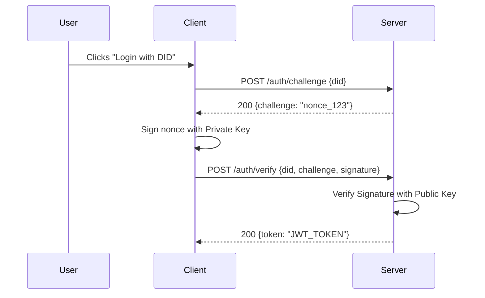
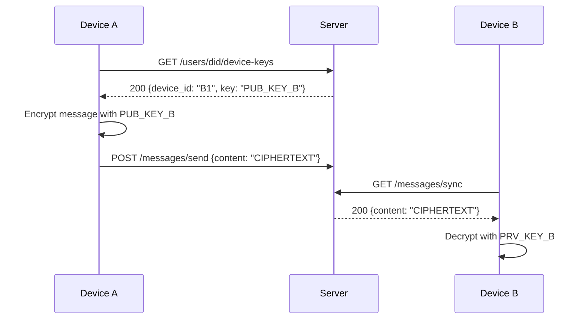

# API Quick Reference

Base URL: `http://localhost:8000/api/v1`

This document lists all available API endpoints for testing with Postman or cURL.

## 🔐 Authentication & Security

### Sequence: DID Challenge-Response


### E2EE Key Exchange


### Register Key
Register a new device encryption key.
```http
POST /auth/register-key
Authorization: Bearer <jwt_token>
Content-Type: application/json

{
  "device_id": "phone-1",
  "public_key": "base64_encoded_key"
}
```

### Rotate Key
Update an existing device key.
```http
POST /auth/rotate-key
Authorization: Bearer <jwt_token>
```

### Register
Create a new user account.
```http
POST /auth/register
Content-Type: application/json

{
  "username": "alice",
  "email": "alice@example.com",
  "password": "password123",
  "display_name": "Alice Chen",
  "bio": "Decentralization enthusiast",
  "avatar_url": "https://example.com/avatar.jpg"
}
```

### Login
Authenticate with username (or email) and password.
```http
POST /auth/login
Content-Type: application/json

{
  "username": "alice",
  "password": "password123"
}
```

### Get Challenge (DID Auth)
Get a challenge nonce for DID-based authentication.
```http
POST /auth/challenge
Content-Type: application/json

{
  "did": "did:splitter:alice-1234..."
}
```

### Verify Challenge (DID Auth)
Verify signed challenge to get JWT.
```http
POST /auth/verify
Content-Type: application/json

{
  "did": "did:splitter:alice-1234...",
  "challenge": "random_nonce_string",
  "signature": "base64_encoded_signature"
}
```

---

## 👤 Users

### Get Current User
Get profile of the authenticated user.
```http
GET /users/me
Authorization: Bearer <jwt_token>
```

### Get User Profile
Get public profile by UUID.
```http
GET /users/:id
```

### Get User by DID
Get public profile by DID.
```http
GET /users/did?did=did:splitter:alice-1234...
```

### Update Profile
Update authenticated user's profile.
```http
PUT /users/me
Authorization: Bearer <jwt_token>
Content-Type: application/json

{
  "display_name": "Alice C.",
  "bio": "Updated bio",
  "avatar_url": "https://example.com/new_avatar.jpg"
}
```

### Delete Account
Permanently delete authenticated user's account.
```http
DELETE /users/me
Authorization: Bearer <jwt_token>
```

### Search Users
Search for users by username.
```http
GET /users/search?q=alice&limit=20&offset=0
Authorization: Bearer <jwt_token>
```

### Request Moderation
Request moderation privileges.
```http
POST /users/me/request-moderation
Authorization: Bearer <jwt_token>
```

---

## 📝 Posts

### Create Post
Create a new post. Text content or file (image) is required.
```http
POST /posts
Authorization: Bearer <jwt_token>
Content-Type: multipart/form-data

content="Hello world!"
visibility="public"
file=@/path/to/image.jpg
```

### Get Post
Get a single post by ID.
```http
GET /posts/:id
```

### Get User Posts
Get all posts by a specific user (by DID).
```http
GET /posts/user/:did?limit=20&offset=0
```

### Get Personal Feed
Get the timeline of posts from users you follow.
```http
GET /posts/feed?limit=20&offset=0
Authorization: Bearer <jwt_token>
```

### Get Public Feed
Get the global public timeline.
```http
GET /posts/public?limit=20&offset=0
```

### Update Post
Edit an existing post.
```http
PUT /posts/:id
Authorization: Bearer <jwt_token>
Content-Type: application/json

{
  "content": "Updated content",
  "visibility": "public"
}
```

### Delete Post
Delete a post.
```http
DELETE /posts/:id
Authorization: Bearer <jwt_token>
```

---

## 💬 Replies

### Create Reply
Reply to a post or another reply.
```http
POST /posts/:id/replies
Authorization: Bearer <jwt_token>
Content-Type: application/json

{
  "post_id": "post_uuid",
  "parent_id": "optional_reply_uuid_if_replying_to_comment",
  "content": "This is a reply!"
}
```

### Get Replies
Get all level replies for a post.
```http
GET /posts/:id/replies
```

---

## 👣 Follows

### Follow User
Follow a user by ID (UUID or DID).
```http
POST /users/:id/follow
Authorization: Bearer <jwt_token>
```

### Unfollow User
Unfollow a user.
```http
DELETE /users/:id/follow
Authorization: Bearer <jwt_token>
```

### Get Followers
Get list of users following a user.
```http
GET /users/:id/followers?limit=50&offset=0
```

### Get Following
Get list of users a user is following.
```http
GET /users/:id/following?limit=50&offset=0
```

### Get Follow Stats
Get counts of followers and following.
```http
GET /users/:id/stats
```

---

## ❤️ Interactions

### Like Post
Like a post.
```http
POST /posts/:id/like
Authorization: Bearer <jwt_token>
```

### Unlike Post
Remove like from a post.
```http
DELETE /posts/:id/like
Authorization: Bearer <jwt_token>
```

### Repost
Repost/Boost a post.
```http
POST /posts/:id/repost
Authorization: Bearer <jwt_token>
```

### Remove Repost
Remove a repost.
```http
DELETE /posts/:id/repost
Authorization: Bearer <jwt_token>
```

### Bookmark Post
Save a post privately.
```http
POST /posts/:id/bookmark
Authorization: Bearer <jwt_token>
```

### Remove Bookmark
Remove a bookmark.
```http
DELETE /posts/:id/bookmark
Authorization: Bearer <jwt_token>
```

### Get Bookmarks
Get all bookmarked posts.
```http
GET /users/me/bookmarks
Authorization: Bearer <jwt_token>
```

---

## 🏷️ Hashtags & Discovery

### Get Trending
Get top 10 trending hashtags.
```http
GET /hashtags/trending
```

### Search Hashtags
Search for tags.
```http
GET /hashtags/search?q=crypto
```

### Get Posts by Tag
Get all posts matching a specific hashtag.
```http
GET /hashtags/tag/splitter?limit=20
```

---

## 📖 Stories

### Create Story
Upload a media story (24-hour expiry).
```http
POST /stories
Authorization: Bearer <jwt_token>
Content-Type: multipart/form-data

file=@/path/to/story.mp4
```

### Get Story Feed
Get stories from users you follow.
```http
GET /stories/feed
Authorization: Bearer <jwt_token>
```

### Record View
Notify the server that a story was viewed.
```http
POST /stories/:id/view
Authorization: Bearer <jwt_token>
```

---

## 🌐 Federation & Well-Known

### WebFinger
Discover actor details.
```http
GET /.well-known/webfinger?resource=acct:alice@splitter.social
```

### ActivityPub Actor
Get ActivityPub JSON represention of a user.
```http
GET /ap/users/alice
Accept: application/activity+json
```

---

## 📨 Messages (Direct Messages)

### Get Threads
Get all conversation threads.
```http
GET /messages/threads
Authorization: Bearer <jwt_token>
```

### Get Thread Messages
Get messages within a specific thread.
```http
GET /messages/threads/:threadId?limit=50&offset=0
Authorization: Bearer <jwt_token>
```

### Start Conversation
Start a new conversation or get existing thread with a user.
```http
POST /messages/conversation/:userId
Authorization: Bearer <jwt_token>
```

### Send Message
Send a direct message.
```http
POST /messages/send
Authorization: Bearer <jwt_token>
Content-Type: application/json

{
  "recipient_id": "user_uuid",
  "content": "Hello there!"
}
```

### Mark Read
Mark all messages in a thread as read.
```http
POST /messages/threads/:threadId/read
Authorization: Bearer <jwt_token>
```

---

## 🛡️ Admin & Moderation (Advanced)

### Federation Inspector
View real-time federation metrics (Admin only).
```http
GET /admin/federation-inspector
Authorization: Bearer <jwt_token>
```

---

## 🌐 Federation & Well-Known Endpoints

Splitter implements ActivityPub for cross-instance federation. These endpoints follow the W3C ActivityPub and WebFinger standards.

### Discovery Endpoints

| Endpoint | Description |
|----------|-------------|
| `GET /.well-known/webfinger?resource=acct:user@domain` | Resolves a user handle to an ActivityPub Actor URI (JRD response) |
| `GET /.well-known/nodeinfo` | *(Planned)* Instance metadata: version, protocols, usage stats |

#### WebFinger Example
```http
GET /.well-known/webfinger?resource=acct:alice@splitter-m0kv.onrender.com
```
```json
{
  "subject": "acct:alice@splitter-m0kv.onrender.com",
  "links": [
    {
      "rel": "self",
      "type": "application/activity+json",
      "href": "https://splitter-m0kv.onrender.com/ap/users/alice"
    }
  ]
}
```

### ActivityPub Actor & Inbox/Outbox

| Endpoint | Description |
|----------|-------------|
| `GET /ap/users/:username` | ActivityPub Actor JSON-LD profile |
| `POST /ap/users/:username/inbox` | Receive inbound activities from remote instances |
| `GET /ap/users/:username/outbox` | Paginated outbox of public activities |
| `POST /ap/shared-inbox` | Shared inbox for optimised multi-recipient delivery |

### Supported Activity Types

| Activity | Direction | Description |
|----------|-----------|-------------|
| `Create` | In/Out | New posts and stories |
| `Follow` | In/Out | Follow request to another actor |
| `Accept` | In/Out | Acknowledge a follow request |
| `Like` | In/Out | Like interaction on a post |
| `Announce` | In/Out | Repost/Boost a post |
| `Undo` | In/Out | Reverse a previous activity (unlike, unfollow) |
| `Delete` | In/Out | Remove a post or story |

### Security Requirements for Inbound Activities

All inbound federation POST requests must include:
- `Signature` header — HTTP Signatures (RSA-SHA256) signed with the sender's private key
- `Digest` header — SHA-256 digest of the request body
- `Date` header — within ±30 seconds (clock sync required; use NTP)

Requests that fail signature verification are silently dropped.


### Domain Block
Block a malicious instance.
```http
POST /admin/domains/block
Authorization: Bearer <jwt_token>
{
  "domain": "spam-instance.com",
  "reason": "Repeated spam traffic"
}
```

### Get All Users
List all users (Admin only).
```http
GET /admin/users?limit=50&offset=0
Authorization: Bearer <jwt_token>
```

### Get Suspended Users
List suspended users (Admin/Mod).
```http
GET /admin/users/suspended?limit=50&offset=0
Authorization: Bearer <jwt_token>
```

### Suspend User
Suspend a user account (Admin/Mod).
```http
POST /admin/users/:id/suspend
Authorization: Bearer <jwt_token>
Content-Type: application/json

{
  "reason": "Violation of terms"
}
```

### Unsuspend User
Restore a suspended user (Admin/Mod).
```http
POST /admin/users/:id/unsuspend
Authorization: Bearer <jwt_token>
```

### Update User Role
Change user role to 'user', 'moderator', or 'admin' (Admin only).
```http
PUT /admin/users/:id/role
Authorization: Bearer <jwt_token>
Content-Type: application/json

{
  "role": "moderator"
}
```

### Get Moderation Requests
List pending moderation requests (Admin only).
```http
GET /admin/moderation-requests
Authorization: Bearer <jwt_token>
```

### Approve Moderation Request
Approve a request (Admin only).
```http
POST /admin/moderation-requests/:id/approve
Authorization: Bearer <jwt_token>
```

### Reject Moderation Request
Reject a request (Admin only).
```http
POST /admin/moderation-requests/:id/reject
Authorization: Bearer <jwt_token>
```

### Get Admin Actions
View audit log of admin actions (Admin only).
```http
GET /admin/actions?limit=50&offset=0
Authorization: Bearer <jwt_token>
```

---

## 🏥 System & Errors

### Health Check
Check if the API is running.
```http
GET /health
```

### Common Error Codes

| Status | Code | Description |
| --- | --- | --- |
| 400 | `INVALID_DID` | The provided DID format is incorrect. |
| 401 | `CHALLENGE_EXPIRED` | Nonce expired; request a new challenge. |
| 403 | `INSUFFICIENT_PERMISSIONS` | Role (User) cannot perform Admin action. |
| 404 | `USER_NOT_FOUND` | No account matches the ID/DID. |
| 429 | `RATE_LIMIT_EXCEEDED` | Too many requests; slow down. |
