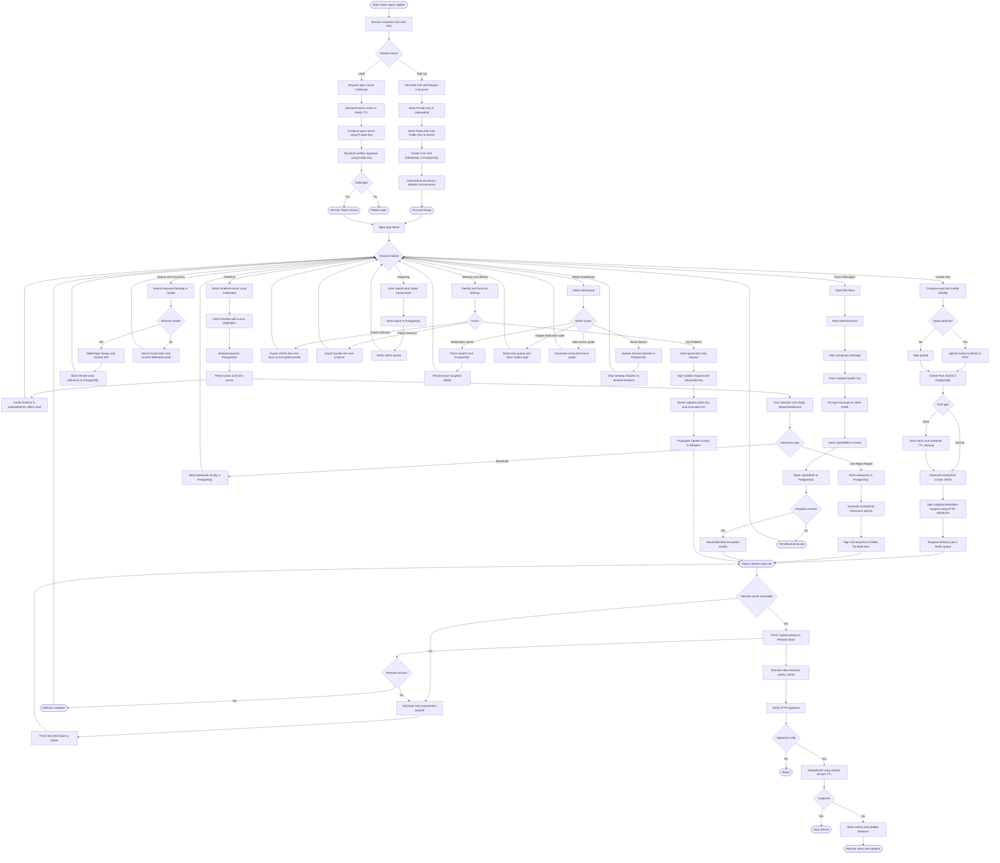

# Activity Diagram

This flowchart shows the complete user journey and system workflows in the Splitter federated social media platform, from initial signup through all major features including posting, federation, messaging, and moderation.

## Key Workflows Covered

### 1. Onboarding & Authentication
- **Signup**: DID and keypair generation in browser, private key stored locally
- **Login**: Challenge-response authentication with signature verification

### 2. Main Navigation
Central hub with access to all major modules:
- Timelines
- Post creation
- Search & discovery
- Direct messages
- Settings & identity management
- Reporting
- Admin dashboard

### 3. Timeline Viewing
- Home, Local, and Federated timelines
- Cursor-based pagination
- Offline caching in IndexedDB

### 4. Post Creation & Federation
- Text and media posts
- Story posts with TTL
- ActivityPub Create activity generation
- HTTP signature signing
- Async delivery via Redis queue
- Retry mechanism with exponential backoff

### 5. User Interactions
- Bookmarks (local only)
- Likes, replies, reposts (federated)
- ActivityPub activity generation and delivery

### 6. Search & Discovery
- Local search for posts and users
- WebFinger lookup for remote handles
- Remote actor caching

### 7. Direct Messaging (E2EE)
- End-to-end encryption on client
- Server stores only ciphertext
- Federated encrypted message delivery

### 8. Identity Management
- Key rotation with signature verification
- Export/import identity "suitcase"
- Update activity propagation

### 9. Content Moderation
- User reporting system
- Admin moderation queue
- Domain blocking (defederation)
- Federation statistics monitoring

### 10. Remote Inbox Processing
- HTTP signature verification
- Activity deduplication
- Timeline updates for remote users

## System Components

- **Frontend**: Browser-based DID generation, encryption, signing
- **IndexedDB**: Client-side key storage and offline cache
- **Backend API**: Go + Echo framework
- **PostgreSQL**: Primary data store
- **Redis**: Job queues and caching
- **Outbox Worker**: Async federation delivery
- **Media Store**: MinIO or IPFS
- **Remote Servers**: Federated ActivityPub instances
