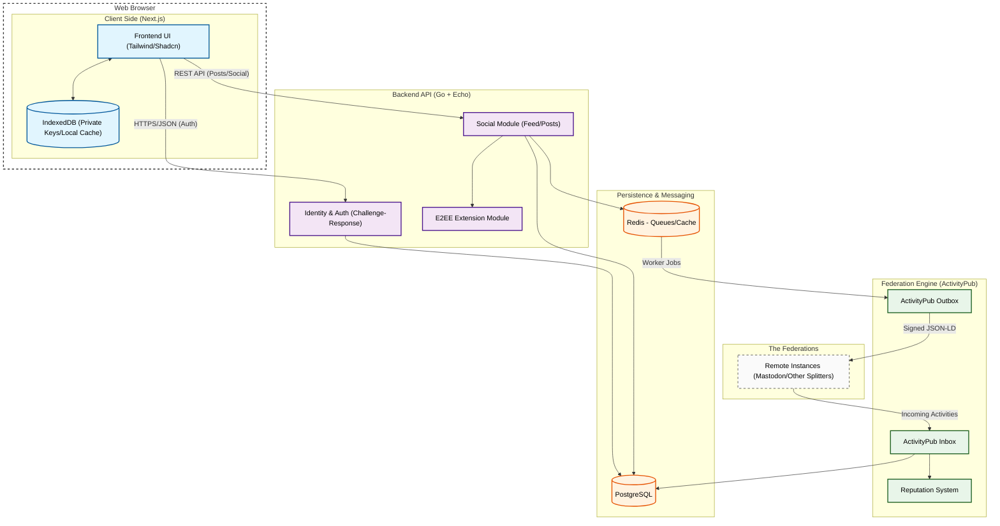

# Architecture Diagram

This diagram shows the complete system architecture of the Splitter federated social media platform, including all layers from the browser client to external federated instances.

## Architecture Layers

### 1. Browser Layer (Client Side)
**Frontend UI** (Next.js + Tailwind + Shadcn)
- User interface components
- DID generation and key management
- Client-side encryption for E2EE messages

**IndexedDB**
- Private key storage (never sent to server)
- Offline content cache
- Timeline caching for offline reading

### 2. Backend API Layer (Go + Echo)
**Identity & Auth Module**
- Challenge-response authentication
- DID verification
- Signature validation

**Social Module**
- Post creation and management
- Timeline aggregation (Home/Local/Federated)
- Interaction handling (likes, replies, reposts)

**E2EE Extension Module**
- Encrypted message storage (ciphertext only)
- Public key distribution
- Message thread management

### 3. Data Layer
**PostgreSQL**
- Primary data store for all entities
- User profiles, posts, interactions
- Federation activities and remote actors

**Redis**
- Job queues for async federation delivery
- Caching for performance
- Nonce storage for authentication
- Activity deduplication

### 4. Federation Layer (ActivityPub)
**ActivityPub Inbox**
- Receives incoming federated activities
- HTTP signature verification
- Activity deduplication
- Stores remote posts and interactions

**ActivityPub Outbox**
- Sends outgoing activities to remote instances
- HTTP signature signing
- Retry mechanism with exponential backoff
- Delivery tracking

**Reputation System**
- Monitors instance health
- Tracks delivery success/failure rates
- Circuit breaker for problematic instances

### 5. External Federation
**Remote Instances**
- Other Splitter instances
- Mastodon servers
- Any ActivityPub-compatible platform

## Data Flow

### Authentication Flow
1. User enters credentials in **Frontend UI**
2. **Auth Module** generates nonce challenge
3. Frontend signs nonce with private key from **IndexedDB**
4. **Auth Module** verifies signature using public key from **PostgreSQL**
5. Session token issued on success

### Post Creation & Federation Flow
1. User creates post in **Frontend UI**
2. **Social Module** stores post in **PostgreSQL**
3. Job enqueued in **Redis** queue
4. **Outbox Worker** picks job and signs activity
5. Signed JSON-LD sent to **Remote Instances**
6. Remote instances send to their **Inbox**
7. **Reputation System** tracks delivery success

### Incoming Federation Flow
1. **Remote Instance** sends activity to **Inbox**
2. **Inbox** verifies HTTP signature
3. Activity deduplicated via **Redis**
4. Activity and content stored in **PostgreSQL**
5. **Reputation System** updated

### E2EE Messaging Flow
1. User composes message in **Frontend UI**
2. Message encrypted client-side using recipient's public key
3. **E2EE Module** stores only ciphertext in **PostgreSQL**
4. For remote recipients, encrypted activity sent via **Outbox**

## Technology Stack

| Layer | Technologies |
|-------|-------------|
| **Frontend** | Next.js, React, Tailwind CSS, Shadcn UI |
| **Client Storage** | IndexedDB, Web Crypto API |
| **Backend** | Go 1.21+, Echo framework |
| **Database** | PostgreSQL 15 (Neon Cloud) |
| **Cache/Queue** | Redis |
| **Federation** | ActivityPub, JSON-LD, HTTP Signatures |
| **Encryption** | Ed25519 (DID), bcrypt (passwords), E2EE (messages) |

## Security Features

- **DID-based Identity**: Decentralized identifiers with client-side key generation
- **Challenge-Response Auth**: No passwords sent over the wire
- **HTTP Signatures**: All federated requests cryptographically signed
- **E2EE Messaging**: Server cannot decrypt messages
- **Reputation System**: Automatic blocking of malicious instances
- **Activity Deduplication**: Prevents replay attacks
