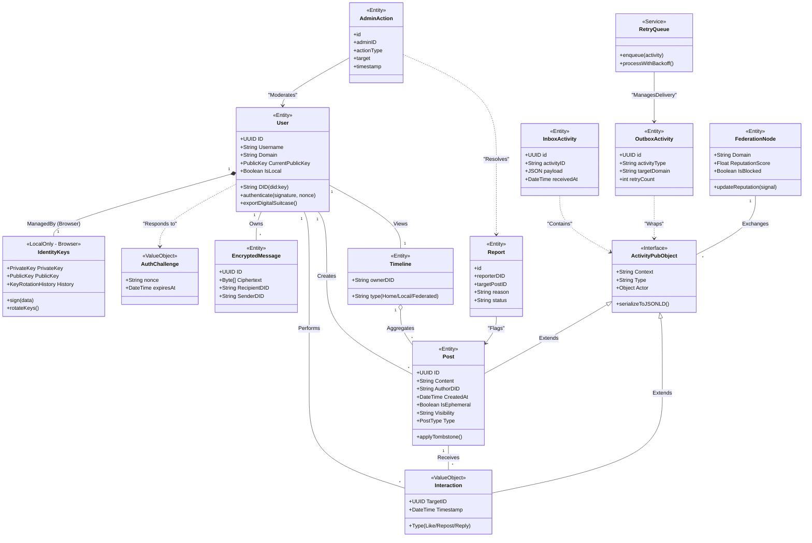

# Class Diagram

This diagram shows the object-oriented design of the Splitter federated social media platform, including all major entities, value objects, services, and their relationships organized by Epic.

## Class Categories

### Epic 1: Identity & Autonomy

**User** (Entity)
- Core user entity with DID-based identity
- Supports authentication via signature verification
- Can export digital suitcase for portability

**IdentityKeys** (LocalOnly - Browser)
- Private key management in browser
- Never sent to server
- Supports key rotation

**AuthChallenge** (ValueObject)
- Challenge-response authentication
- Time-limited nonce for security

### Epic 3 & 4: Social & Messaging

**Post** (Entity)
- User-generated content
- Supports ephemeral posts (stories)
- Visibility controls (public, followers, circle)
- Tombstone support for deletion

**Interaction** (ValueObject)
- Likes, reposts, and replies
- Immutable interaction records

**EncryptedMessage** (Entity)
- End-to-end encrypted messaging
- Server stores only ciphertext

**Timeline** (Entity)
- Aggregates posts for different views
- Types: Home, Local, Federated

### Epic 2: Federation Infrastructure

**ActivityPubObject** (Interface)
- Base interface for ActivityPub activities
- JSON-LD serialization

**InboxActivity** (Entity)
- Incoming federated activities
- Deduplication and verification

**OutboxActivity** (Entity)
- Outgoing federated activities
- Retry tracking

**RetryQueue** (Service)
- Manages failed delivery retries
- Exponential backoff

**FederationNode** (Entity)
- Remote server representation
- Reputation scoring
- Domain blocking

### Epic 5: Governance & Moderation

**Report** (Entity)
- Content moderation reports
- Status tracking

**AdminAction** (Entity)
- Audit log for admin actions
- Moderates users and resolves reports

## Key Relationships

### Composition & Aggregation
- User **owns** IdentityKeys (composition, browser-only)
- Timeline **aggregates** Posts (aggregation)

### Associations
- User **creates** Posts (1:N)
- User **performs** Interactions (1:N)
- Post **receives** Interactions (1:N)
- User **owns** EncryptedMessages (1:N)

### Dependencies
- User **responds to** AuthChallenge
- Report **flags** Post
- AdminAction **moderates** User
- AdminAction **resolves** Report

### Inheritance
- Post **extends** ActivityPubObject
- Interaction **extends** ActivityPubObject

### Federation
- InboxActivity **contains** ActivityPubObject
- OutboxActivity **wraps** ActivityPubObject
- RetryQueue **manages delivery** of OutboxActivity
- FederationNode **exchanges** ActivityPubObject

## Design Patterns

- **Entity**: Domain objects with identity (User, Post, etc.)
- **Value Object**: Immutable objects without identity (Interaction, AuthChallenge)
- **Service**: Stateless operations (RetryQueue)
- **Interface**: Contract for polymorphism (ActivityPubObject)
