# Entity-Relationship Diagram

This diagram shows the complete database schema for the Splitter federated social media platform, including all tables, relationships, and key constraints.

```mermaid
erDiagram
    users ||--o{ user_keys : "has"
    users ||--o{ bookmarks : "creates"
    users ||--o{ moderation_requests : "requests"
    users ||--o{ moderation_requests : "reviews"
    users ||--o{ message_threads : "participates_a"
    users ||--o{ message_threads : "participates_b"
    users ||--o{ messages : "sends"
    users ||--o{ messages : "receives"
    
    posts ||--o{ media : "has"
    posts ||--o{ interactions : "receives"
    posts ||--o{ bookmarks : "bookmarked_in"
    posts ||--o{ reports : "reported_in"
    
    message_threads ||--o{ messages : "contains"
    
    users {
        uuid id PK
        text username
        text email UK
        text password_hash
        text instance_domain
        text did UK
        text display_name
        text bio
        text avatar_url
        text public_key
        text role
        boolean moderation_requested
        timestamptz moderation_requested_at
        boolean is_locked
        boolean is_suspended
        timestamptz created_at
        timestamptz updated_at
    }
    
    remote_actors {
        uuid id PK
        text actor_uri UK
        text username
        text instance_domain
        text did
        text public_key
        text inbox_url
        text outbox_url
        timestamptz last_fetched_at
        timestamptz created_at
    }
    
    user_keys {
        uuid id PK
        uuid user_id FK
        text public_key
        text key_type
        boolean is_revoked
        timestamptz created_at
    }
    
    follows {
        uuid id PK
        text follower_did
        text following_did
        text status
        timestamptz created_at
    }
    
    posts {
        uuid id PK
        text author_did
        text content
        text visibility
        boolean is_remote
        text original_post_uri
        timestamptz created_at
        timestamptz updated_at
        timestamptz deleted_at
        timestamptz expires_at
    }
    
    media {
        uuid id PK
        uuid post_id FK
        text media_url
        text media_type
        timestamptz created_at
    }
    
    interactions {
        uuid id PK
        uuid post_id FK
        text actor_did
        text interaction_type
        timestamptz created_at
    }
    
    bookmarks {
        uuid id PK
        uuid user_id FK
        uuid post_id FK
        timestamptz created_at
    }
    
    message_threads {
        uuid id PK
        text participant_a
        text participant_b
        uuid participant_a_id FK
        uuid participant_b_id FK
        timestamptz created_at
        timestamptz updated_at
    }
    
    messages {
        uuid id PK
        uuid thread_id FK
        text sender_did
        text recipient_did
        uuid sender_id FK
        uuid recipient_id FK
        bytea ciphertext
        text content
        boolean is_read
        timestamptz created_at
        timestamptz delivered_at
    }
    
    inbox_activities {
        uuid id PK
        text activity_id UK
        text actor_uri
        text activity_type
        jsonb payload
        timestamptz received_at
    }
    
    outbox_activities {
        uuid id PK
        text activity_type
        jsonb payload
        text target_inbox
        text status
        int retry_count
        timestamptz created_at
    }
    
    activity_deduplication {
        text activity_id PK
        timestamptz processed_at
        timestamptz expires_at
    }
    
    moderation_requests {
        uuid id PK
        uuid user_id FK
        text status
        text reason
        uuid reviewed_by FK
        timestamptz reviewed_at
        timestamptz created_at
    }
    
    blocked_domains {
        text domain PK
        text reason
        text blocked_by
        timestamptz blocked_at
    }
    
    reports {
        uuid id PK
        text reporter_did
        uuid post_id FK
        text reason
        text status
        timestamptz created_at
        timestamptz resolved_at
    }
    
    admin_actions {
        uuid id PK
        text admin_id
        text action_type
        text target
        text reason
        timestamptz created_at
    }
    
    instance_reputation {
        text domain PK
        int reputation_score
        int spam_count
        int failure_count
        timestamptz updated_at
    }
    
    federation_failures {
        text domain PK
        int failure_count
        timestamptz last_failure_at
        timestamptz circuit_open_until
    }
```

## Key Relationships

- **Users** create and manage multiple **User Keys** for device authentication
- **Users** create **Bookmarks** for posts they want to save
- **Users** can request to become moderators via **Moderation Requests**
- **Users** participate in **Message Threads** and send/receive **Messages**
- **Posts** can have multiple **Media** attachments
- **Posts** receive **Interactions** (likes, reposts) from users
- **Posts** can be **Bookmarked** by users
- **Posts** can be **Reported** for moderation
- **Message Threads** contain multiple **Messages** between two participants

## Cardinality Legend

- `||--o{` : One-to-Many relationship
- `PK` : Primary Key
- `FK` : Foreign Key
- `UK` : Unique Key
