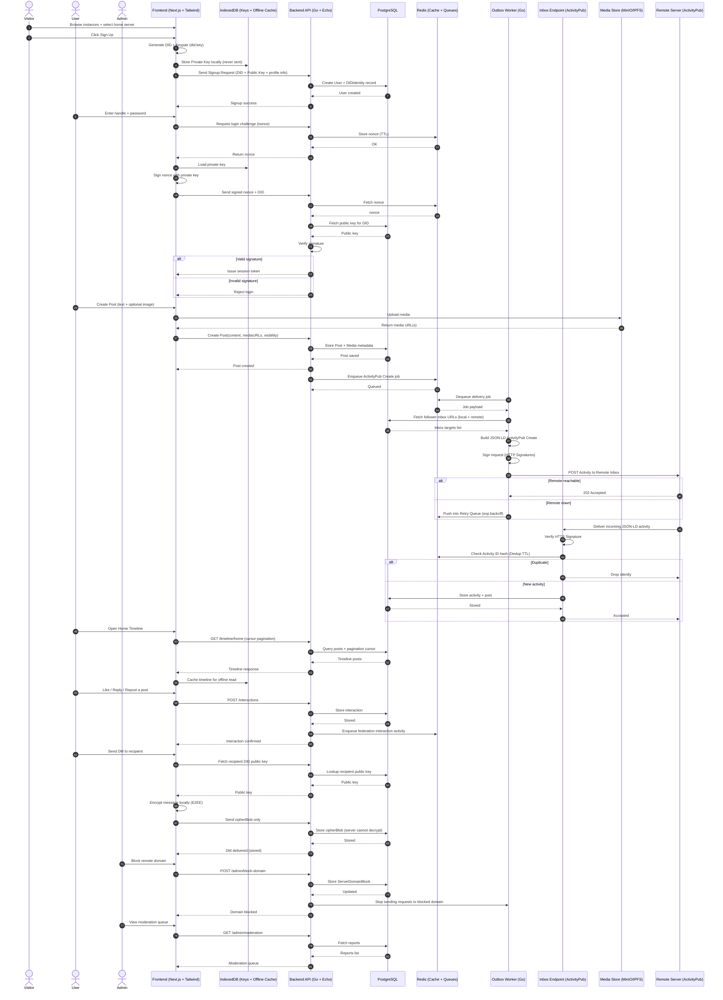

# Sequence Diagrams

This document shows the complete interaction flows for the Splitter federated social media platform, including authentication, post creation, federation, messaging, and moderation.

## Key Flows Covered

### 1. User Registration (Steps 1-7)
- Visitor browses instances and selects home server
- DID and keypair generated client-side
- Private key stored locally in IndexedDB (never sent to server)
- User record created in PostgreSQL

### 2. Authentication (Steps 8-18)
- Challenge-response authentication using DID signatures
- Nonce stored in Redis with TTL
- Signature verification using public key from database
- Session token issued on successful authentication

### 3. Post Creation (Steps 19-24)
- Media upload to media store (MinIO/IPFS)
- Post and media metadata stored in PostgreSQL
- Post creation confirmed to frontend

### 4. Federation Outbox (Steps 25-35)
- ActivityPub Create activity enqueued in Redis
- Outbox worker processes delivery jobs
- HTTP Signatures used for request signing
- Retry queue for failed deliveries with exponential backoff

### 5. Federation Inbox (Steps 36-43)
- Incoming activities verified via HTTP Signatures
- Activity deduplication using Redis cache
- Activities and posts stored in PostgreSQL

### 6. Timeline Loading (Steps 44-49)
- Cursor-based pagination for efficient loading
- Timeline cached in IndexedDB for offline access

### 7. Post Interactions (Steps 50-55)
- Likes, replies, and reposts stored in database
- Federation activities enqueued for remote delivery

### 8. Direct Messaging (Steps 56-64)
- End-to-end encryption (E2EE)
- Messages encrypted client-side before sending
- Server stores only ciphertext (cannot decrypt)

### 9. Moderation & Defederation (Steps 65-75)
- Admin can block remote domains
- Outbox worker stops deliveries to blocked domains
- Moderation queue for content reports

## Components

- **Frontend**: Next.js + Tailwind CSS
- **IndexedDB**: Client-side key storage and offline cache
- **Backend API**: Go + Echo framework
- **PostgreSQL**: Primary data store
- **Redis**: Caching and job queues
- **Outbox Worker**: Async federation delivery
- **Inbox Endpoint**: ActivityPub activity receiver
- **Media Store**: MinIO or IPFS for media files
- **Remote Server**: Other federated instances
