# State Diagram

This diagram shows the complete lifecycle of all major entities in the Splitter application, including user states, post states, follow relationships, messages, federation activities, moderation requests, content reports, and session states.

```mermaid
stateDiagram-v2
    [*] --> Unregistered: Application Start
    
    state "User Lifecycle" as UserLifecycle {
        Unregistered --> Registering: Click Signup
        Registering --> Registered: Complete Registration
        Registering --> Unregistered: Cancel
        
        Registered --> Authenticating: Click Login
        Authenticating --> Authenticated: Valid Credentials
        Authenticating --> Registered: Invalid Credentials
        
        Authenticated --> Active: Session Valid
        Active --> Authenticated: Token Refresh
        Active --> Registered: Logout
        Active --> Suspended: Admin Action
        Suspended --> Active: Admin Unsuspend
        
        Active --> RequestingModerator: Request Moderator Role
        RequestingModerator --> Active: Request Pending
        RequestingModerator --> Moderator: Request Approved
        RequestingModerator --> Active: Request Rejected
        
        Moderator --> Admin: Promoted by Admin
        Admin --> Moderator: Demoted by Admin
        Moderator --> Active: Role Revoked
    }
    
    state "Post Lifecycle" as PostLifecycle {
        [*] --> Composing: Create Post
        Composing --> Publishing: Submit
        Composing --> [*]: Cancel
        
        Publishing --> Published: Success
        Publishing --> Composing: Validation Error
        
        Published --> Editing: Edit Post
        Editing --> Published: Save Changes
        Editing --> Published: Cancel Edit
        
        Published --> Reported: User Reports
        Reported --> UnderReview: Moderator Reviews
        UnderReview --> Published: Approved
        UnderReview --> Removed: Violation Found
        
        Published --> Deleted: User/Admin Deletes
        Removed --> Deleted: Archive
        
        Published --> Expired: TTL Reached
        Expired --> [*]
        Deleted --> [*]
    }
    
    state "Follow Relationship" as FollowLifecycle {
        [*] --> NotFollowing: Initial State
        NotFollowing --> FollowRequested: Click Follow
        FollowRequested --> Following: Auto-Accept (Public)
        FollowRequested --> Pending: Requires Approval (Private)
        Pending --> Following: Approved
        Pending --> NotFollowing: Rejected
        Following --> NotFollowing: Unfollow
        FollowRequested --> NotFollowing: Cancel Request
    }
    
    state "Message Lifecycle" as MessageLifecycle {
        [*] --> Composing: Start Message
        Composing --> Encrypting: Send
        Encrypting --> Sending: Encryption Complete
        Sending --> Sent: Delivered to Server
        Sent --> Delivered: Received by Recipient
        Delivered --> Read: Recipient Opens
        Read --> [*]
        Sending --> Failed: Network Error
        Failed --> Composing: Retry
    }
    
    state "Federation Activity" as FederationLifecycle {
        [*] --> Created: Local Activity
        Created --> Queued: Add to Outbox
        Queued --> Sending: Process Queue
        Sending --> Sent: HTTP 200
        Sending --> Retrying: HTTP 5xx
        Retrying --> Sent: Success
        Retrying --> Failed: Max Retries
        Sent --> [*]
        Failed --> [*]
        
        [*] --> Received: Remote Activity
        Received --> Validating: Check Signature
        Validating --> Processing: Valid
        Validating --> Rejected: Invalid
        Processing --> Applied: Success
        Applied --> [*]
        Rejected --> [*]
    }
    
    state "Moderation Request" as ModerationLifecycle {
        [*] --> Pending: User Submits
        Pending --> UnderReview: Admin Opens
        UnderReview --> Approved: Admin Approves
        UnderReview --> Rejected: Admin Rejects
        Approved --> [*]: Role Granted
        Rejected --> [*]: Request Closed
    }
    
    state "Content Report" as ReportLifecycle {
        [*] --> Submitted: User Reports
        Submitted --> InReview: Moderator Assigned
        InReview --> Investigating: Gathering Evidence
        Investigating --> Resolved: Action Taken
        Investigating --> Dismissed: No Violation
        Resolved --> [*]
        Dismissed --> [*]
    }
    
    state "Session State" as SessionLifecycle {
        [*] --> NoSession: Not Logged In
        NoSession --> CreatingSession: Login
        CreatingSession --> ActiveSession: JWT Issued
        ActiveSession --> RefreshingSession: Token Near Expiry
        RefreshingSession --> ActiveSession: Token Refreshed
        ActiveSession --> ExpiredSession: Token Expired
        ExpiredSession --> NoSession: Clear Session
        ActiveSession --> NoSession: Logout
    }
```

## State Lifecycles

### 1. User Lifecycle
**States**: Unregistered → Registering → Registered → Authenticating → Authenticated → Active → Moderator → Admin

**Key Transitions**:
- Signup process with cancellation option
- Authentication with credential validation
- Role progression: Active → Moderator → Admin
- Suspension and unsuspension by admin
- Logout returns to Registered state

### 2. Post Lifecycle
**States**: Composing → Publishing → Published → Edited/Reported/Deleted/Expired

**Key Transitions**:
- Validation errors return to Composing
- Published posts can be edited, reported, or deleted
- Reported posts go through moderation review
- TTL expiration for ephemeral posts (stories)

### 3. Follow Relationship
**States**: NotFollowing → FollowRequested → Following/Pending

**Key Transitions**:
- Auto-accept for public accounts
- Approval required for private accounts
- Unfollow returns to NotFollowing
- Request cancellation option

### 4. Message Lifecycle
**States**: Composing → Encrypting → Sending → Sent → Delivered → Read

**Key Transitions**:
- E2EE encryption before sending
- Network error handling with retry
- Delivery confirmation
- Read receipts

### 5. Federation Activity
**Outbound**: Created → Queued → Sending → Sent/Retrying/Failed
**Inbound**: Received → Validating → Processing → Applied/Rejected

**Key Transitions**:
- Outbox queue processing
- HTTP status-based retry logic
- Signature validation for incoming activities
- Success/failure terminal states

### 6. Moderation Request
**States**: Pending → UnderReview → Approved/Rejected

**Key Transitions**:
- Admin review process
- Role granted on approval
- Request closed on rejection

### 7. Content Report
**States**: Submitted → InReview → Investigating → Resolved/Dismissed

**Key Transitions**:
- Moderator assignment
- Evidence gathering phase
- Action taken or dismissed

### 8. Session State
**States**: NoSession → CreatingSession → ActiveSession → RefreshingSession/ExpiredSession

**Key Transitions**:
- JWT token issuance on login
- Automatic token refresh before expiry
- Session expiration handling
- Logout clears session
