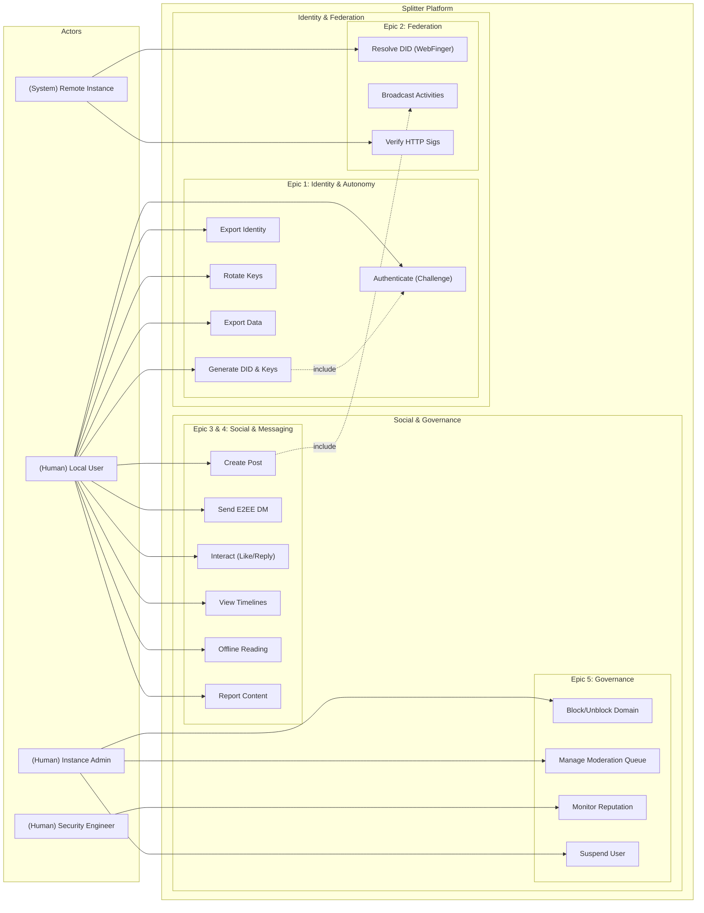

# Use Case Diagram

This diagram shows all the use cases in the Splitter federated social media platform, organized by Epic and showing the actors who interact with each use case.

## Actors

### Local User (Human)
Primary user of the platform who:
- Creates and manages their DID-based identity
- Authenticates using challenge-response
- Creates posts and interacts with content
- Sends encrypted direct messages
- Views timelines and reads content offline
- Reports inappropriate content

### Remote Instance (System)
Federated server that:
- Resolves DIDs via WebFinger
- Verifies HTTP signatures on incoming activities

### Instance Admin (Human)
Administrator who:
- Blocks/unblocks remote domains (defederation)
- Manages the moderation queue
- Suspends problematic users

### Security Engineer (Human)
Technical role that:
- Monitors instance reputation scores
- Analyzes federation health

## Use Cases by Epic

### Epic 1: Identity & Autonomy
- **Generate DID & Keys**: Create decentralized identity in browser
- **Authenticate (Challenge)**: Sign challenge with private key
- **Export Identity**: Export identity for migration
- **Rotate Keys**: Update keypair for security
- **Export Data**: Download all user data (data portability)

### Epic 2: Federation
- **Resolve DID (WebFinger)**: Discover remote users
- **Broadcast Activities**: Send ActivityPub activities to followers
- **Verify HTTP Sigs**: Validate incoming federated requests

### Epic 3 & 4: Social & Messaging
- **Create Post**: Publish text/media content
- **Send E2EE DM**: Send end-to-end encrypted messages
- **Interact (Like/Reply)**: Engage with posts
- **View Timelines**: Browse Home/Local/Federated feeds
- **Offline Reading**: Access cached content without network
- **Report Content**: Flag inappropriate posts

### Epic 5: Governance
- **Block/Unblock Domain**: Manage federation blocklist
- **Manage Moderation Queue**: Review and resolve reports
- **Monitor Reputation**: Track instance health metrics
- **Suspend User**: Temporarily disable user accounts

## Relationships

### Include Relationships
- **Generate DID & Keys** includes **Authenticate**: Identity creation enables authentication
- **Create Post** includes **Broadcast Activities**: Posts are federated via ActivityPub

## Actor Responsibilities

| Actor | Primary Responsibilities |
|-------|-------------------------|
| **Local User** | Identity management, content creation, social interaction |
| **Remote Instance** | Federation protocol compliance, signature verification |
| **Instance Admin** | Moderation, governance, domain management |
| **Security Engineer** | Security monitoring, reputation analysis |
